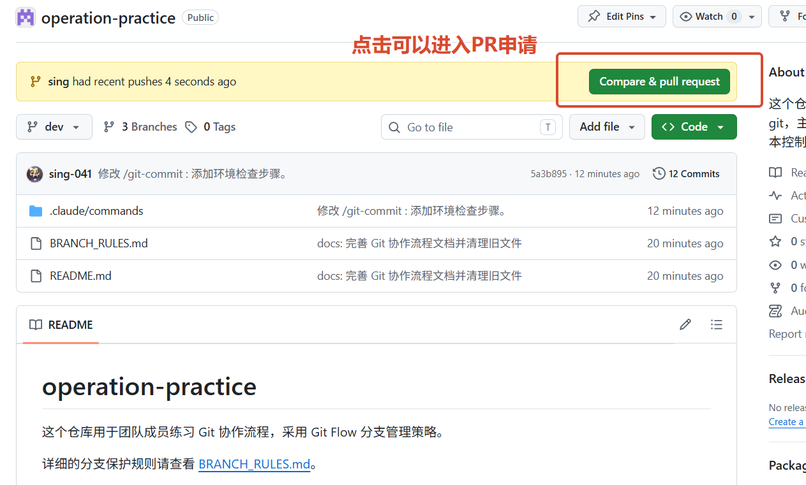
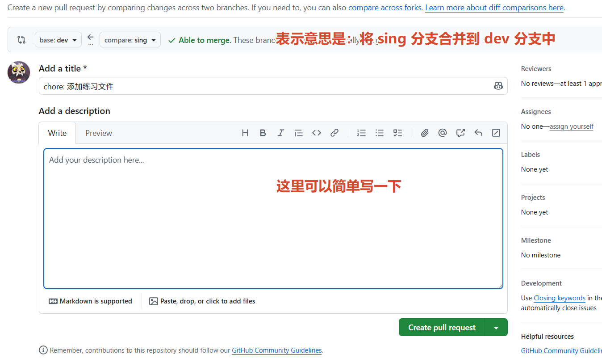

# operation-practice

这个仓库用于团队成员练习 Git 协作流程，采用 Git Flow 分支管理策略。

详细的分支保护规则请查看 [BRANCH_RULES.md](BRANCH_RULES.md)。

## 1 第一次开发（本地还没有仓库）

```bash
git clone git@github.com:ai-ETF/operation-practice.git
cd operation-practice
git checkout dev
git pull origin dev
```

- 由于默认分支就是 `dev` 分支，所以拉取下来就直接再 `dev` 分支上。

## 2 每次开发的完整流程

### 2.1 拉取最新代码并创建功能分支

```bash
git checkout dev
git pull origin dev
git checkout -b feature/你的功能名
```

> ⚠️ 先创建分支再写代码，不要在 dev 上直接改代码。

### 2.2 写代码，然后提交

```bash
git add .
git commit -m "feat: 简要描述你做了什么"
```

这步虽然很简单，commit message 要写好却很难，所以要求，统一使用 `/git-commit`这条 Claude command 来完成这个步骤。

```claude
/git-commit
```


### 2.3 推送到远程仓库

```bash
git push -u origin feature/你的功能名
```

- 【写代码 -> 提交 】这个步骤可以反复多次，待到相对满意了再推送到远程仓库


### 2.4 提交 Pull Request

1. 打开 GitHub 仓库页面：`https://github.com/ai-ETF/operation-practice`
2. 点击 **Pull requests** 页面，点击 **New pull request**

3. **base 选择 `dev`**，compare 选择你的功能分支

4. 填写标题和说明，点击 **Create pull request**
5. 等待队友审核通过后合并


### 2.5 清理本地分支

PR 合并后，删除本地的功能分支：

```bash
git checkout dev
git pull origin dev
git branch -d feature/你的功能名
```
